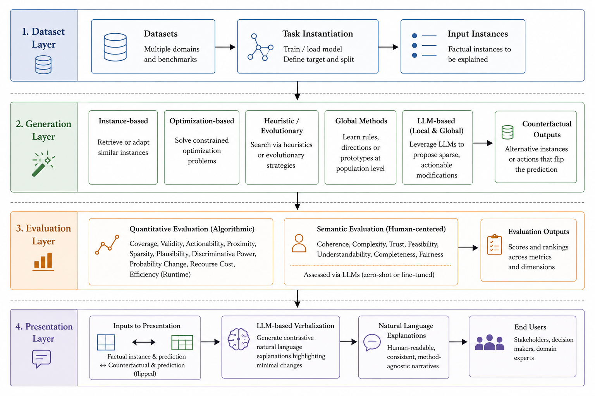

# CFX-Bench

This is the official codebase for the paper **"CFX-Bench: A Benchmark for Counterfactual Explanations"**.

---

The full pipeline implemented in the repository is as follows:



---

## Setup

CFX-Bench was developed on Python `3.10`. You can install the dependencies with:

```bash
pip install -r requirements.txt
```

---

## Repository structure

```
CFX-Bench/
├── data/                     # Dataset files and resources
├── docs/
│   ├── datasets.md
│   ├── extending.md
│   ├── metrics.md
│   └── reproducibility.md
├── evaluation/               # Quantitative and global evaluation metrics
├── explainers/               # Local and global counterfactual explainers
│   ├── global_explainers/    # Global counterfactual methods
│   └── base.py               # Base interface for new explainers
├── llm_clients/              # Interfaces for local and API-based LLMs
├── llm_prompts/              # Prompts for LLM-based generation and evaluation
├── scripts/                  # Auxiliary scripts, including LLM-based evaluation
├── main.py                   # Main benchmark execution pipeline
├── dataset.py                # Dataset abstraction and configuration
├── classifiers.py            # Predictive model definitions
├── explanation.py            # Counterfactual explanation representation
├── test_case_generator.py    # Factual-instance selection strategies
└── utils.py                  # Shared utilities
```

---

## Usage

### Main benchmark

```bash
python -u main.py \ 
  --dataset german-credit \ 
  --explainer_name dice \ 
  --model_name lr \ 
  --test_case auto-refuse
```

| Parameter          | Admissible values (default)                                                                                           | Description                                                                          |
|--------------------|-----------------------------------------------------------------------------------------------------------------------|--------------------------------------------------------------------------------------|
| `--dataset`        | `german-credit`, `lending-club`, `adult`, `compas`                                                                    | Dataset used to train the predictive model and generate counterfactual explanations. |
| `--explainer_name` | `ar`, `dice`, `face`, `nice`, `optbin`, `proce`, `llm-local`, `ares`, `globe-ce`, `facegroup`, `glance`, `llm-global` | Counterfactual explanation method to evaluate.                                       |
| `--model_name`     | `lr` (default: `lr`)                                                                                                  | Predictive classifier used by the benchmark.                                         |
| `--test_case`      | `auto-refuse` (default), `border`, `neg_border`, `pos_border`, `fp`, `fn`                                             | Strategy used to select factual instances to explain.                                |
| `--seed`           | integer (default: `42`)                                                                                               | Random seed used for dataset/model operations and supported explainers.              |
| `--dice-solver`    | `random` (default), `genetic`, `kdtree`                                                                               | Generation strategy used by DiCE. Only relevant when `--explainer_name dice`.        |

#### Explainers

- Local explainers: `ar`, `dice`, `face`, `nice`, `optbin`, `proce`, `llm-local`
- Global explainers: `ares`, `globe-ce`, `facegroup`, `glance`, `llm-global`

#### LLM-based baselines

CFX-Bench provides two lightweight prompt-based reference baselines:

- **LLM-LCE (`llm-local`)**: generates instance-level counterfactuals by prompting an LLM to propose minimal changes to actionable features.
- **LLM-GCE (`llm-global`)**: derives population-level recourse strategies by prompting an LLM to identify and aggregate relevant feature-level changes.

These baselines are simple, extensible reference implementations rather than optimized counterfactual generation algorithms. Their prompts and LLM backends can be adapted to investigate alternative prompting strategies and models.

#### Selection strategies

Strategies to select factual instances are defined as follows:
- `auto-refuse`: records whose positive class predicted probability is below `0.5` - **default**
- `border`: records whose positive class predicted probability is between `0.45` and `0.55`
- `neg_border`: records whose positive class predicted probability is between `0.45` and `0.50`
- `pos_border`: records whose positive class predicted probability is between `0.50` and `0.55`
- `fp`: false positives
- `fn`: false negatives

---

### LLM-based verbalization and evaluation

```bash
python -u scripts/llm_eval.py \ 
  --dataset german-credit \ 
  --test_case auto-refuse \ 
  --explainer_name dice \ 
  --model_name lr \ 
  --llm gpt-4o-mini
```

| Parameter          | Admissible values (default)                                                                                           | Description                                                                          |
|--------------------|-----------------------------------------------------------------------------------------------------------------------|--------------------------------------------------------------------------------------|
| `--llm`            | `llama-3.1-8b`, `mistral-small-3.2`, `gpt-4o-mini`                                                                    | LLM used to verbalize and evaluate counterfactual explanations.                      |
| `--dataset`        | See above                                                                                                             | Dataset used to train the predictive model and generate counterfactual explanations. |
| `--explainer_name` | `ar`, `dice`, `face`, `nice`, `optbin`, `proce`, `llm-local`, `ares`, `globe-ce`, `facegroup`, `glance`, `llm-global` | Counterfactual explanation method to evaluate.                                       |
| `--model_name`     | See above                                                                                                  | Predictive classifier used by the benchmark.                                         |
| `--test_case`      | `auto-refuse` (default), `border`, `neg_border`, `pos_border`, `fp`, `fn`                                             | Strategy used to select factual instances to explain.                                |


Available LLMs are:
- `llama-3.1-8b`: `Llama-3.1-8B-Instruct`, can run locally with the HuggingFace interface
- `mistral-small-3.2`: `Mistral-Small-3.2-24B-Instruct-2506`, can run locally but needs its custom interface on top of HuggingFace
- `gpt-4o-mini`: requires API calls
